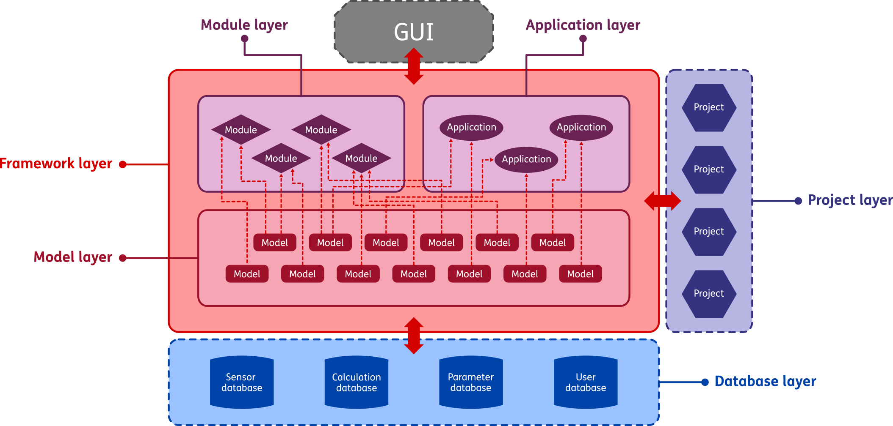

GEMINI architecture
===========================

GEMINI is a software framework for the modelling and real-time monitoring of geothermal assets. In this section, a high-level overview is given of the architecture of the GEMINI platform. The overall architecture can be divided into two sides: the functional architecture, and technical architecture. The former of these two defines the different components of the platform and how they connect to each other, while the latter defines which tools (software packages) that are used to achieve the intended functionality of the GEMINI platform and they interact with each other.

Functional architecture
---------------------------

:numref:`fig-func-architecture` gives an overview of the different functional layers of the GEMINI platform, and how they interact. As can be seen, the platform consists of the following layers:

*   The framework layer
*   The model layer
*   The module layer
*   The application layer
*   The project layer
*   The database layer
*   A Graphical User Interface (GUI)

In the next subsections each of these layers will be explained in more detail.

.. _fig-func-architecture:

    Overview of the functional architecture of the GEMINI digital twin framework.

Framework layer
~~~~~~~~~~~~~~~~~~

The framework is the most critical layer within the GEMINI platform, and functions as the foundation that connect all other layers and components to each other. It contains all the functionalities that allow all internal components to interact with each other and with external components. Functionalities include things such as the scheduler which ensures module calculations are executed at fixed time intervals, reading and writing from/to databases, creating, saving, and opening projects, etc.

Model layer
~~~~~~~~~~~~~~~~~~
The model layer contains all models used in the GEMINI architecture. A model is a script that takes an input and provides a corresponding output. Models can be static, meaning that it is a pure input-output function, or dynamic, meaning it has an internal state that is used to calculate the next ouput and updated each time the model is called. Model examples include well VLP, fluid PVT, and erosion calculations.

Module layer
~~~~~~~~~~~~~~~~~~
A module is a collection of one or more models that together calculate a certain output or provide a certain utility/service to the user. The key aspect of a module is that it is bound to a schedule, and is thus automatically executed at a fixed time interval, e.g. every five minutes, every hour, every day at 06:00, etc. An example of a module would be the real-time monitoring of certain KPI's like injectivity index, which can be calculated based on the most recent data every half hour (for example).

Application layer
~~~~~~~~~~~~~~~~~~
Like a module, an application is a collection of models that together calculate a certain output or provide a certain utility/service to the user. However, where the execution of modules is tied to the scheduler, applications are "on-demand", and can be run whenever desired by a user. Typically, applications allow a user to change certain calculations paramaters in order to perform more in-depth analyses of data or KPI's or update/tune model parameters. For instance, the injectivity module might show a Hall plot that is always calculated for the latest 3 months of data, while in the injectivity application, a user can easily select a different starting time of the data to analyze more recent or long-term trends.

When compared, modules are more the "set-it-and-forget-it" type of component (i.e. the settings are defined once at the start of a project, and then automatically calculated at fixed intervals without the user having to worry about it), while applications require more direct interaction with the user.

Project layer
~~~~~~~~~~~~~~~~~~
A project is an instance of a specific combination of components, settings, and data of a system for which the digital twin is set up. For instance, a project can be created for an entire geothermal doublet, but also for only the production or injection wells individually, or even for just a single asset like the electrical submersible pump. Projects can be freely created, saved, and opened at later times to continue working within it. All relevant parameters and settings are saved per project and restored when the project is re-opened. Since a project is specific to a physical asset, projects are placed outside of the main GEMINI platform, and will not be shared between users from different parties.

Database layer
~~~~~~~~~~~~~~~~~~
The database layer contains a number of databases: a plant database from which real-time sensor data can be retrieved, a calculation database to which calculated values can be written, a parameter database to contain plant-specific parameters, and finally a database to store account information of the various users of the system. Of course, the database layer differs per geothermal plant and is therefore not part of the general GEMINI framework.

Graphical User Interface
~~~~~~~~~~~~~~~~~~
The GUI (Graphical User Interface) is the interactive visual layer built "on top of" the GEMINI platform. Through the GUI a user can interact with the various functionalities, modules, and applications in the framework.

Internal vs. external layers
~~~~~~~~~~~~~~~~~~
Within the GEMINI platform there is a distinction made between *internal* and *external* layers. The main difference is in whether something is general-purpose or plant/asset-specific. This is also related to the open-source release of the platform, since only internal components will be part of the open-source release. Internal layers are denoted as blocks with solid outlines in :numref:`fig-func-architecture`, while external layers have dashed outlines. Internal layers include the GEMINI framework, the model layer, module layer, and applications layer, while the database, project, and GUI are all external layers. Technically, the GUI can be included in the internal layers, as it is not necessarily plant/asset-specific, but the aim of GEMINI is to allow any interested party to build their own visualization on top of the main platform. 

Technical architecture
---------------------------