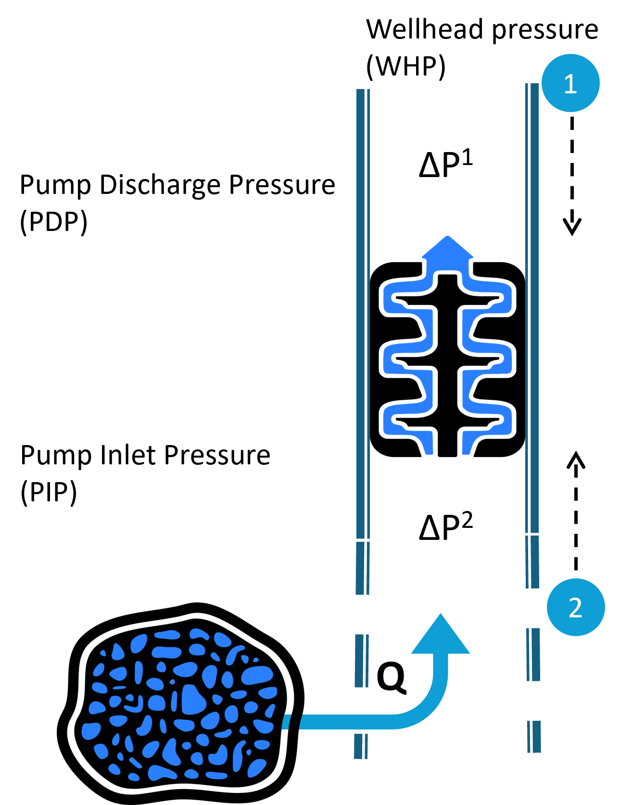
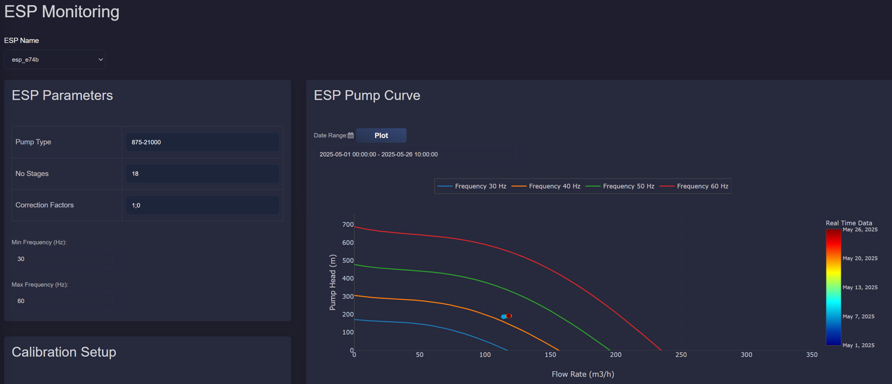
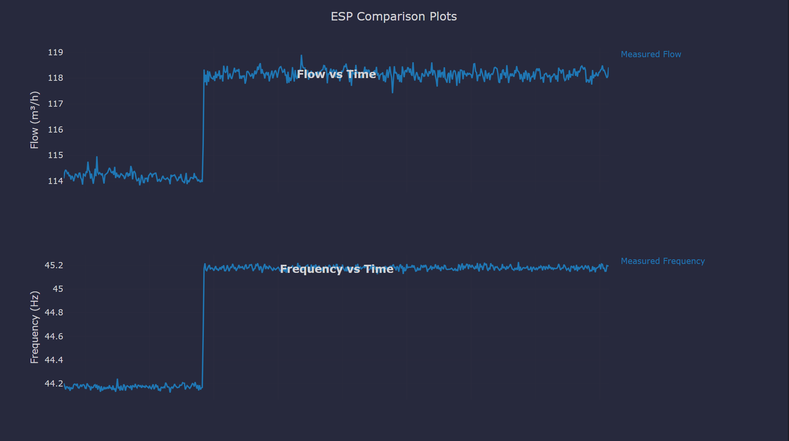
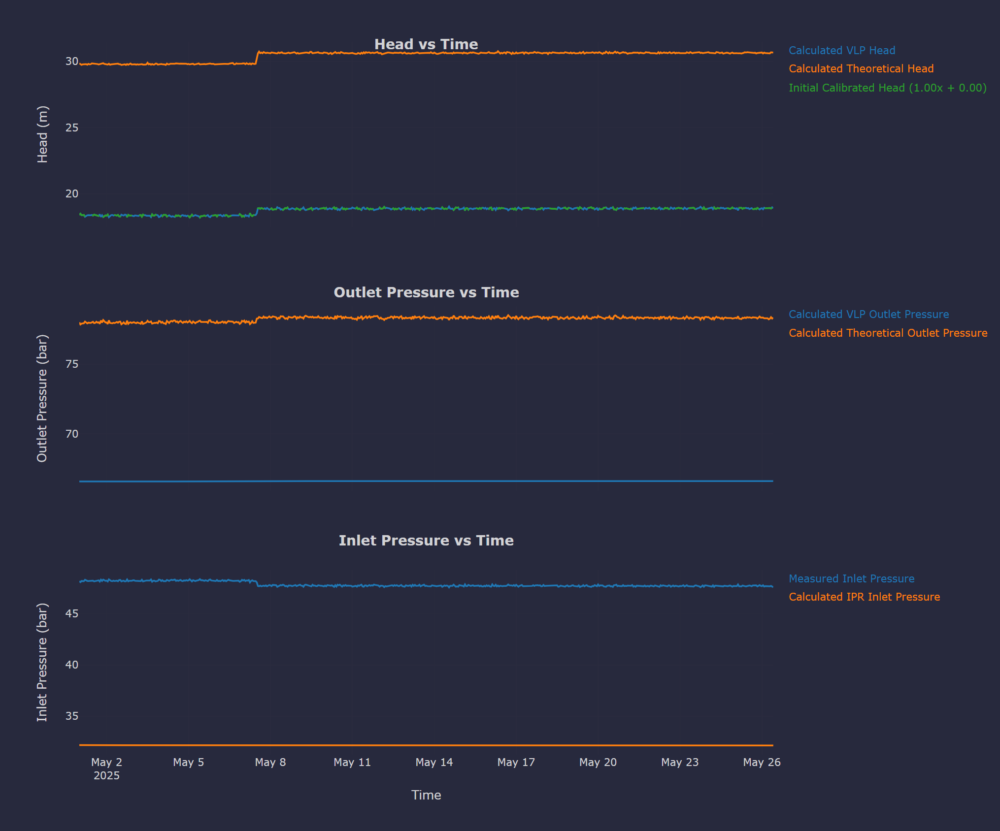
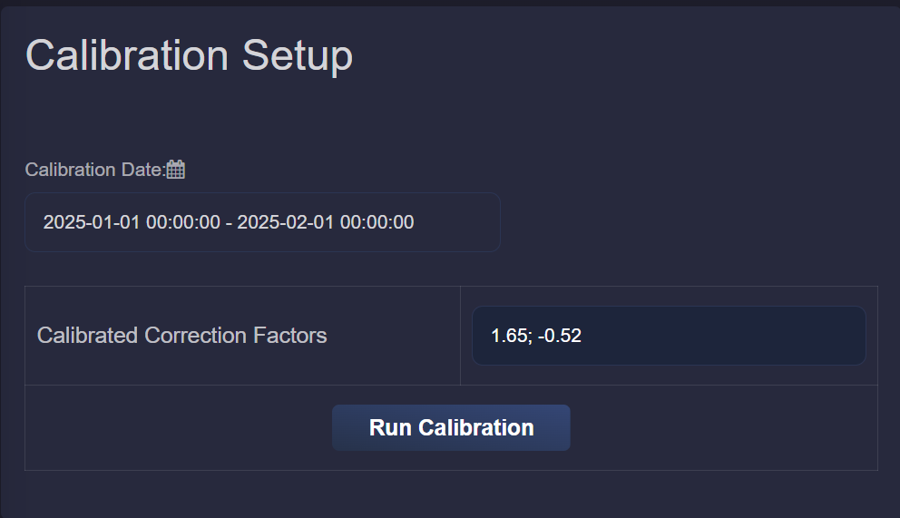
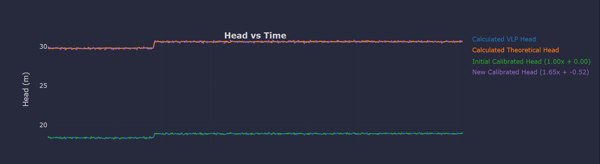

ESP Performance
===========================

Description
---------------------------

This application provides the following features for monitoring Electric Submersible Pumps (ESP) in geothermal reservoirs.

ESPs are installed in production wells to provide additional lift when the reservoir pressure is not sufficient to bring the fluid to the surface. They increase pressure between the pump intake (inlet) and discharge (outlet).

The schematic below illustrates a typical pressure profile across a geothermal production well equipped with an ESP:

Pump Curve
---------------------------

This part of the application shows the ESP pump curve from the manufacturer, plotted as head versus flowrate. On top of this, real-time operating data is added to show actual pump performance.

Since there is usually no discharge pressure sensor in the ESP system, the pump head is estimated using two values:

- Inlet pressure, measured directly by a downhole sensor.

- Upper pressure difference (:math:`\Delta P^{1}`), calculated using the VLP (as described in :doc:`application_production_well_performance`) from the top of the ESP to the wellhead.

From these, we estimate the actual pressure increase provided by the pump. This gives us the real-time pump head, which is plotted with the flowrate on top of the manufacturer pump curve.
 

This helps users compare actual pump performance against expected behavior and identify whether the ESP is operating efficiently.

ESP Comparison plots
---------------------------

This section shows time-based comparisons between real-time measurements and expected values from ESP models. A screenshot of the interface is shown below:

**Head Comparison**

This is the most critical plot, used later in the calibration step. It includes:

- VLP Head: calculated using pressure drop from the top of the ESP to the wellhead (since no discharge sensor is available) and measured intake pressure.

- Theoretical Head: calculated from the manufacturer pump curve using current flow and frequency.

- Calibrated Head: VLP head adjusted using calibration coefficients (if applied) to better match the theoretical head.

If no calibration is applied, default values are used with :math:`a = 1` and :math:`b = 0`. This helps users to see the initial mismatch between measured and expected pump behavior.

**Outlet Pressure Comparison**

Since there is no discharge pressure sensor, it shows:

- VLP-based Outlet Pressure: calculated from the pressure drop above the ESP and wellhead pressure.

- Theoretical Outlet Pressure: calculated using the measured inlet pressure and theoretical pump head.

**Inlet Pressure Comparison**

This compares:

- Measured Inlet Pressure: from the ESP sensor at the pump intake.

- Calculated Inlet Pressure: calculated from IPR (using reservoir pressure and flowrate, as described in :doc:`application_production_well_performance`) and VLP (from reservoir to pump location, using bottomhole pressure and pressure drop in the lower stage of the ESP, :math:`\Delta P^{2}`).

These comparisons act as diagnostic tools to check consistency between measurements and expected values. Deviations in head, outlet, or inlet pressures may indicate uncalibrated models, measurement errors, or operational issues.

Calibration Setup
----------------------------
In this section, users can run a simple linear calibration to align the VLP-calculated head with the theoretical pump head.

By clicking "Run Calibration", the application performs a linear fit of the form :math:`ax+b` for a selected time period. After calibration, the updated head comparison plot is shown with the calibrated values, by clicking "Plot".

The calibration coefficients :math:`a` and :math:`b` are displayed in the calibration window. These can then be saved in the Parameters Overview so the calibration is applied to future ESP performance evaluations.

    
