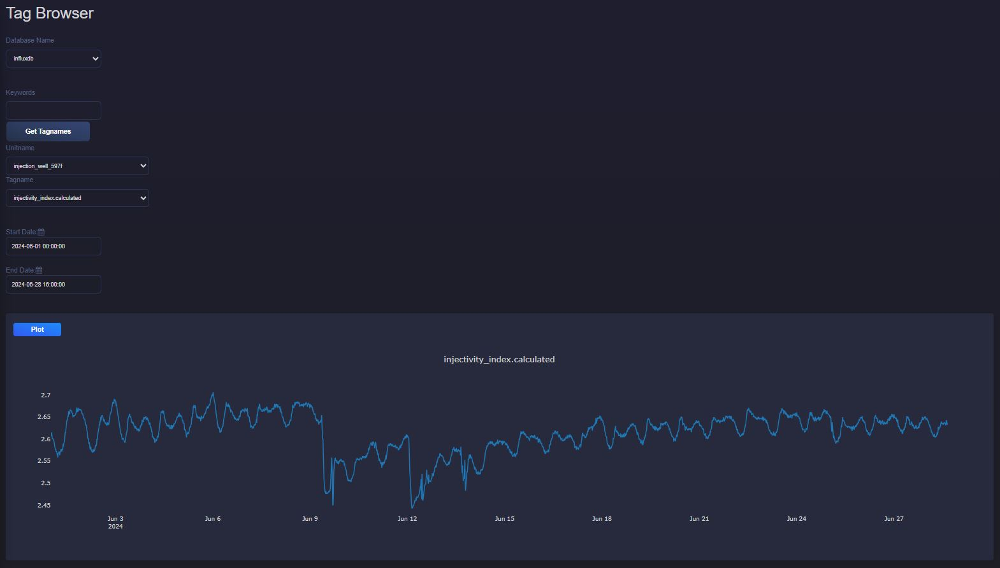

Injectivity Application
===========================

Description
---------------------------
This application provides the following features as the monitoring tools for injection in geothermal reservoir.

Injectivity Index
---------------------------
The injectivity index (:math:`II`) is a measure of the capacity of a reservoir to accept fluids and drived from Darcy's Law (:math:`Q = - \frac{kA}{\mu L} \Delta P`). It reads:

.. math::

    II = -\frac{Q}{\Delta P} = -\frac{Q}{P_{res} - BHP}

where:

- :math:`Q` is the injection rate
- :math:`P_{res}` is the reservoir pressure
- :math:`BHP` is the bottomhole pressure
- :math:`\Delta P` is the pressure difference (reservoir pressure - bottomhole pressure)

Injectivity index can be plotted for specefic duration and a selected well via Tag Browser in the main menu:

Hall plot and its Derivative
----------------------------
The Hall integral equation is used in well testing to analyze injectivity. It integrates the pressure difference between bottomhole and reservoir over time and being plotted versus cumulative flow rate. 

The Hall integral (:math:`HI`) is given by:

.. math::

    HI = \int_{0}^{t} (\Delta P) dt

where:

- :math:`\Delta P` is the pressure difference (bottomhole pressure - reservoir pressure)
- :math:`t`  is the time

The derivative of a Hall plot (:math:`D_{Hall}`) can be calculated numerically by :

.. math::

    D_{Hall} = \frac{d \int_{0}^{t} (\Delta P) dt}{d \ln (Q)}

where:

- :math:`\Delta P` is the pressure difference (bottomhole pressure - reservoir pressure)
- :math:`t`  is the time
- :math:`Q` is the flow rate

This tool allows to select a specific time duration and reservoir pressure as the inputs for the Hall plot for a selected well.

.. image:: images/application_injectivity_HallPlot.JPG
    :width: 100%

* The two curves of Hall and its derivative trace the same path when neither plugging or improvement occurs! 

Skin factor plot
---------------------------
Real-time flow rate and pressure can be plotted and compared with skin lines. Skin lines are calculated using specific reservoir properties and well parameters. For a given flow rate and skin factor value, the injection pressure can be calculated. Depending on which skin factor line the real-time data crosses, the corresponding skin effect in the reservoir can be determined. A positive skin factor indicates that the reservoir is damaged and may require treatment. The equations used to calculate the skin lines are as follows:

.. math::

    P_{inj} = BHP - \Delta P_{hydrostatic} + \Delta P_{fric}

    BHP = P_{reservoir} + \Delta P_{flow} + \Delta P_{skin}

    \Delta P_{hydrostatic} = \rho_{brine} . g . H_{top res}

    
    \Delta P_{flow} = \frac{Q \cdot \mu_{brine} \cdot \ln\left(\frac{r_{res}}{r_{well}}\right)}{2 \cdot \pi \cdot k \cdot h}

    \Delta P_{skin} = \frac{Q \cdot \mu_{brine} \cdot \text{Skin}}{2 \cdot \pi \cdot k \cdot h}

Pressure drop due to the friction is calculated using Darcy-Weisbach correlation and Darcy friction coefficient (Swamee-Jain) as follows:

.. math::
    
    \Delta P_{fric} = f \cdot \rho_{brine} \cdot \frac{L}{D} \cdot \frac{V^2}{2}

    f = \frac{0.25}{\left(\log_{10} \left(\frac{\varepsilon}{3.7 D} + \frac{5.74}{Re^{0.9}}\right)\right)^2}

    Re = \frac{v \cdot L \cdot \rho_{brine}}{\mu_{brine}}

where:

- :math:`Q` is the injection rate
- :math:`P_{inj}` is the calculated pressure for a given flow rate and skin factor
- :math:`H_{top res}` is the top reservoir depth
- :math:`\mu_{brine}` is the viscosity of the brine
- :math:`\rho_{brine}` is the density of the brine
- :math:`r_{res}` is the radius of influence of the reservoir
- :math:`r_{well}` is the well radius
- :math:`k` is the reservoir permeability
- :math:`h` is the reservoir thickness
- :math:`L` is the well length
- :math:`D` is the well diameter
- :math:`V` is the velocity inside the well
- :math:`f` is the friction coefficient of the well
- :math:`\varepsilon` is the roughness of the well
- :math:`Re` is the Reynolds number

A Q-P plot, including skin lines, can be generated for a specific duration and a selected well using the required well and reservoir parameters:

