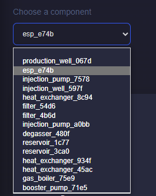
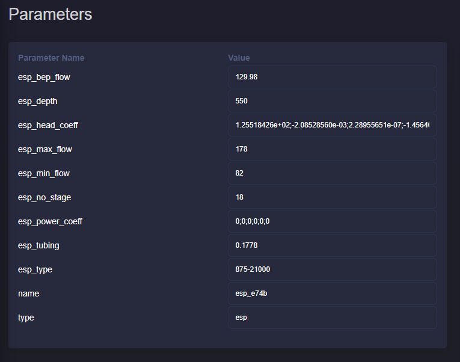
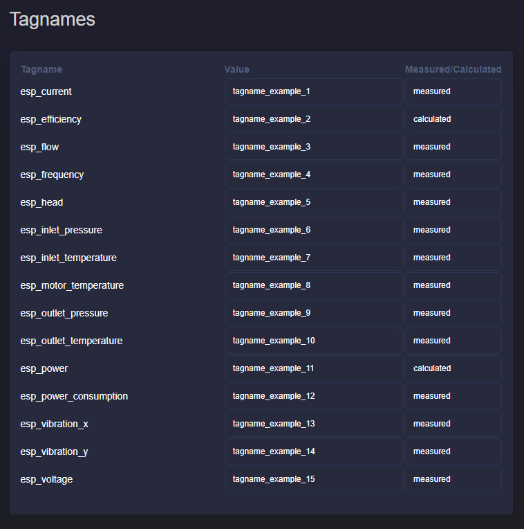

Parameters overview
===========================

Description
---------------------------
This application gives an overview of all the parameters and tagnames that describe the assets of the geothermal plant. The application allows to quickly check and modify the parameters of any asset in the plant model.

Overview of parameters and tagnames
-------------------------------------

The user can select the asset from a dropdown list. The assets included in the list are obtained for the plant diagram that is created for the current project. If the current project has not a diagram yet, then the dropdown list should be empty.

As soon as the user selects the asset of interest the tables are updated automatically. A list of the asset names is given. If the asset name is not defined, it is automatically updated with the asset type and the first 4 digits of the asset ID. The user can later update the name if needed. An example of a dropdown list is observed with the above figure.

In the picture above you can observe an example of the asset parameters for an ESP. The table shows the parameter name and value. The parameter values are given in editable cells. This means that the user can simply select the current value and fill in the new value. For fields like **esp_head_coeff** or **esp_power_coeff** where an array of values is required, the user should separate the values with semicolons (;).

In the picture above you can observe an example of the asset tagnames for an ESP. The table shows the tagname name, value and if each tagname value was measured or calculated. Similarily to the parameter table, the tagname value and the Measured/Calculated field can be modified by the user.

Modify parameters
----------------------------
The user can have an overview of the current parameters. It is also possible to modify the parameters and tagnames of the assets.

.. image:: images/parameters_overview_update_button.png
    :width: 20%

The user should press the update button on the bottom-left of the page to keep the modified parameter and tagname values. The update button should be also pressed even if the user wants to switch to another asset in the parameters overview application. The new values are then update for the entire project.
