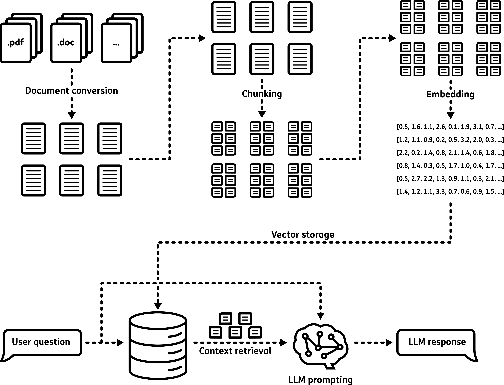

Chat Assistant
===========================

Description
---------------------------
The Chat Assistant is a feature of GEMINI which allows the user to interact with their uploaded reports.
The interaction is as simple as asking a question in natural language.
This is achieved by employing a Large Language Model (LLM).
The core strength of this AI model is its ability to understand and generate natural language.
The benefit of the Chat Assistant and more specifically the Retrieval-Augmented Generation (RAG) method, is the reduced manually search of documents.

Document Inventory
---------------------------
A prerequisite for the Chat Assistant is to provide the information in the form of text reports.
Reports can be uploaded in PDF format through the **REPORT** application, located under the section **INFO**.
This interface allows users to upload new reports and browse existing ones.
When uploading a report, the user can enable the option **"document is included for search"** to make the report available to the Chat Assistant.

    By enabling the checkbox "document is included for search", the uploaded report will be indexed and made available to the Chat Assistant for answering user questions.

Document Processing
---------------------------
Uploaded PDF files are automatically processed by the system.
The text is extracted and split into small sections (chunks).
Each chunk is transformed into a numerical representation (embedding) that allows efficient comparison with user questions.
Each report is stored as a set of chunks in a database, dedicated for the Chat Assistant.

Retrieval & Generation
---------------------------
- How the assistant finds relevant parts of the documents.
- Two-step process: retrieval of context and generation of answer.
- Overview of how similarity between questions and report content is calculated.

The Chat Assistant uses a two-step process called Retrieval-Augmented Generation:

    Schematic explaining the workflow of the Retrieval-Augmented Generation method.
    The process includes the indexing the documents, retrieving the context and generating the response.

1. **Retrieval** – The system finds parts of the reports that are similar to the user’s question.
    The question is also converted into a numerical vector and compared to all embeddings of text extracted from the reports.
    A set of the most relevant chunks is selected.
    The selection of embeddings is a selection of parts of the text and will be the context for answering the question.

2. **Generation** – The context and the user’s question are processed by the LLM.
    The model uses its ability to understand and generate natural language to identify the answer in the given context.
    The answer is generated by the LLM and returned on the Chat Assistant interface.

Answer Quality and Best Practices
------------------------------------------------------

Answering questions accurately is a challenging task for the Chat Assistant.
The quality of the answers depends on several factors:

- The clarity and specificity of the user's question
- The quality, structure, and formatting of the uploaded reports
- The ability of the language model to interpret and reason over the retrieved content

Variations in document types and inconsistent formatting can make it harder for the system to retrieve the most relevant information.
Likewise, unclear or overly complex questions may lead to less accurate or incomplete answers.

To improve the quality of responses, users are encouraged to:

- Ask simple and specific questions
- Use terminology that is likely to appear in the uploaded reports
- Break down complex queries into smaller, focused questions when possible

For transparency and validation, the Chat Assistant includes a list of the document parts (citations) that were used to generate the answer.
These citations allow users to:

- Check the source of the information
- Verify the accuracy of the AI-generated response
- Identify which reports are most relevant to the question

By reviewing these citations, users can double-check critical information and explore related sections of the reports as needed.
While the Chat Assistant is a powerful tool for extracting insights, it should be used as a support tool,
especially when high-stakes or critical decisions are involved.

