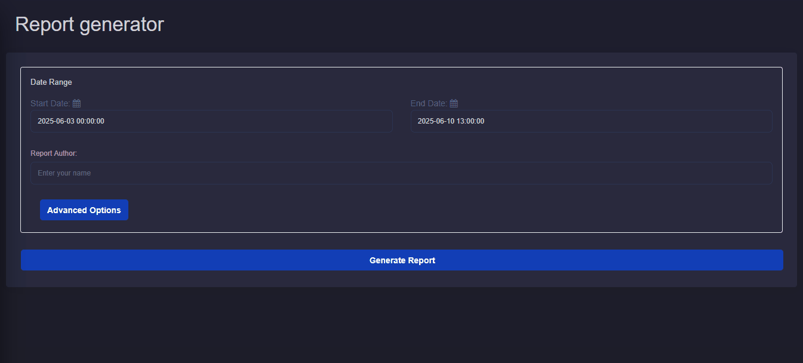
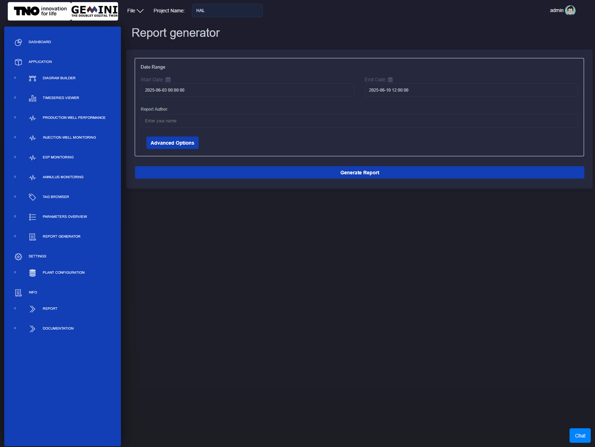
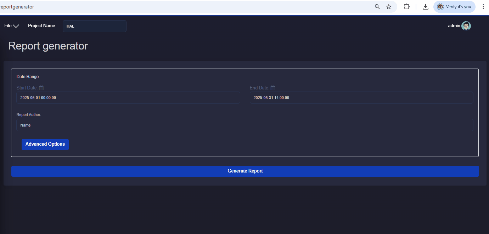

Report Generator
===========================

Description
---------------------------
The Report Generator application is a functionality of GEMINI to reduce the manual repetitive task of creating operational reports.
It can be found in the main list of applications.
User can generate and download the report in seconds by clicking the **Generate Report** button.
Advanced options are available to select or customize specific parts of the report.

Options
---------------------------
**Time range and Author**

To generate a report the time range is required.
The start and end date indicate the period of time for which the data will be plot in the report.
Additionally, the author's name is good to be included but not required.

    Time range and author's name fields for the generation of reports.
    Date is defined with a dedicated input dialog.

**Default options**

By default all available plots are included in the report. Skin lines are plotted based on default parameters. These are:

- Title page
- Summary table providing overview of injection wells and production wells with statistical values.
- Summary plots providing overview of injection wells and production wells with time-series plots and maximum values.
- Injection well report with comprehensive time series values plot.
- Production well report with comprehensive time series values plot.
- ESP report with comprehensive time-series values plot.
- Injection well cross plots with skin lines.
- ESP cross plots.

**Advanced options**

With the advanced options menu the user can adjust the following:

- Disable parts of the report.
- Adjust the skin line parameters. The flow rate range can be adjusted, this is the value on the horizontal axis. The skin factor values can be adjusted which results in different range of values on the vertical axis of the cross plot.
- For the ESP plots individual plots can be disable. Minimum and maximum limit values can be included in the plots if required. The user can type the minimum or maximum value. The limits are not required to be defined. Only available limit values will be plotted.

    The button Advanced Options reveals the options menu.
    The user can adjust the report according to their needs.

Generation
---------------------------
After the user has defined their options the **Generate Report** button can be pressed. The report will be available through the browser in a few seconds.

    The button Generate Report prepares the PDF file. The file can be downloaded directly from the browser.
