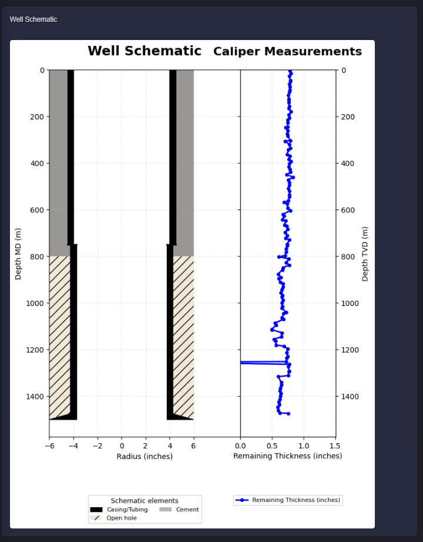
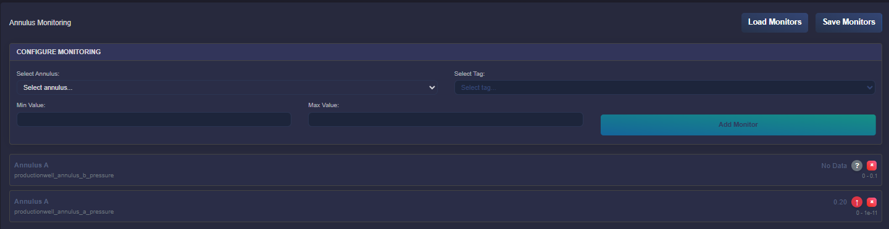

Well Integrity
===========================

Description
---------------------------
This application provides the following features as the monitoring tools for well integrity in geothermal reservoir.

Inputs
--------------------------------------
 * Caliper Log: Only LAS version up to 2.0 is supported. Log file should have `DATE` or `PID` mnemonic to track logging date. In addition, finger channels should be named as `D01`, where the measurement represents the double radii measurement.
 
 * Well Schematic: The well schematic is created in Well Schematics application.

 * Well Tally: Tally file should follow given format:

    .. image:: images/application_wims_4.png
        :width: 100%
        :align: center

Caliper Log Processing
--------------------------------------
Log processing begins as soon as the log is uploaded. Processing involves calcualtaing following parameters per each well joint:    

 * Maximumum, Minimum and Average ID
 * Maximumum loss pecentage 
 * Maximumum penetration and corresponing depth
 * Minimum penetration and corresponing dept
 * Remaining wall thickness for the most pesimistic case

     .. image:: images/application_wims_5.png
        :width: 100%
        :align: center
 
Note: Logs should be calibrated to depth reference which is alligned with the well schematic.

Corrosion Monitoring
--------------------------------------
Remaining wall thickness can be viewed in the well schematic as per selected processed log.

Annulus Monitoring
--------------------------------------
Annulus pressure can be monitored for a given well annulus based on the well schematic and notification can be set by providing min and max values.

