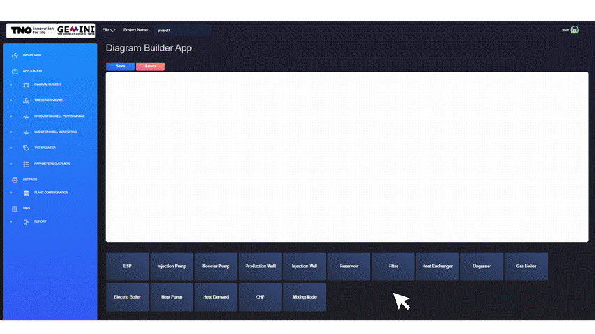
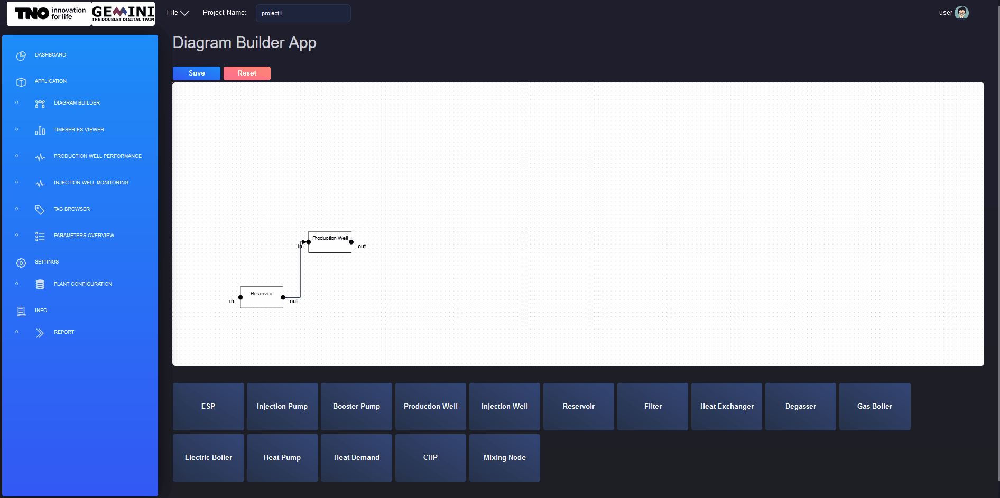
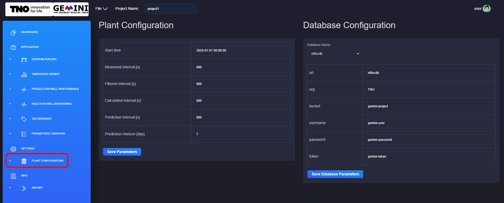

.. _system-setup:

Set-up
==============================================

This page serves as a guide on how to set up your first project, and include step-by-step instructions on how to create a representation of your physical system in the *DIAGRAM BUILDER*, set asset parameters, and link to the corresponding tags in the plant database.

The first step to set-up your project is to create a new project. In the chapter :ref:`Projects <projects>`, instructions for creating a new project are given. If you do not have a project yet, you may go back to this chapter and follow the instructions.

Creating a plant in the DIAGRAM BUILDER
--------------------------------------------
As soon as you have create your project, you can start setting it up. The first thing would be to model the plant geometry.

.. _new-component:

.. figure:: images/diagram_builder_new_component.png
    :width: 100%
    :align: center

    Adding new component in the plant diagram from the *DIAGRAM BUILDER* application.

The *DIAGRAM BUILDER* application allows you to model your plant. For a new project, you will see an empty canvas in the *DIAGRAM BUILDER* application. You now need to add the components comprising your plant. You can do that by clicking on the component you need from the list of components in the bottom of your screen. The list is illustrated in figure :numref:`new-component`.

.. _add-move-component:

    Moving component on canvas from the *DIAGRAM BUILDER* application.

As soon as you click on a component, it will appear on the top left of the canvas. As it is illustrated with figure :numref:`add-move-component`, you need to drag and drop each component to the location of your preference.

.. _connect-components:

.. figure:: animations/diagram_builder_connect_components.gif
    :width: 100%
    :align: center

    Creating a connection between two components from the *DIAGRAM BUILDER* application.

You then need to connect your components to introduce relations between them and create a linear process for your plant. The connection can be created by clicking and dragging from one asset connection point to another. You can see an example in figure :numref:`connect-components`.

Adding asset parameters
--------------------------------------------
Now you should have a diagram of your plant. The next step is to add the required parameters to the components. This is possible via the *DIAGRAM BUILDER* application.

.. _edit-component-parameters:

.. figure:: animations/diagram_builder_edit_component_parameters.gif
    :width: 100%
    :align: center

    Edit components parameters from the *DIAGRAM BUILDER* application.

What you need to do is right click on one component and go through the parameters of the component. In figure :numref:`edit-component-parameters`, an example of a production well is given. In the example the soil temperature, productivity index and friction correlation are modified. Make sure to press the SAVE button to keep your changes. The SAVE button updates the json files in the project folder. Repeat this process for all of the components in your plant model.

For the production well and injection well, the trajectory is required.

Linking tags to plant assets
--------------------------------------------

A tag is the reference that links values that are inputs or are calculated with a module. These values are stored on a database. A tag comprises a tagname and a tagvalue. The tagname is a descriptive name for identifying the type of value and the asset that is refers to and the tagvalue is the variable reference to retrieve the tag value from the database.

.. _edit-component-tags:

    Edit components tags from the *DIAGRAM BUILDER* application.

To link tags to assets in the plant you must follow similar steps as for modifying a parameter value. You first need to open the *DIAGRAM BUILDER*. Then right click on the asset of interest and select "Open Parameter". Finally, switch to the Tagnames tab and fill in tagvalues. Make sure to fill in the values correctly without any typos. You can see the process in figure :numref:`edit-component-tags` above.

Viewing plant configuration and parameters
--------------------------------------------

To modify the general plant parameters you can select the *PLANT CONFIGURATION* application from the *SETTINGS* category.

With the *PLANT CONFIGURATION* window you can configure the plant parameters:
    - Start time
    - Measured Interval, in seconds
    - Filtered Interval, in seconds
    - Calculated Interval, in seconds
    - Prediction Interval, in seconds
    - Prediction Horizon, in days

You can also configure the database parameters:
    - Database name, from the dropdown menu
    - url
    - organisation
    - bucket
    - username
    - password
    - token

.. _plant-configuration:

    Configure the plant parameters and the database parameters from the *PLANT CONFIGURATION* window.

As you can observe in the figure :numref:`plant-configuration` above, a save button is include which you should click to keep your changes.

Uploading and viewing documents
--------------------------------------------

