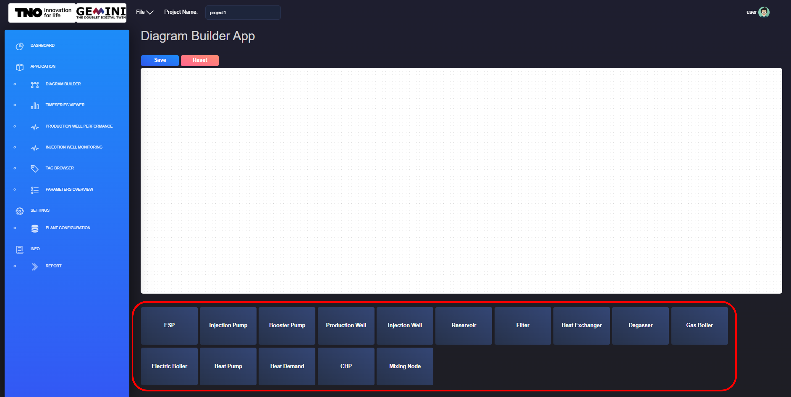
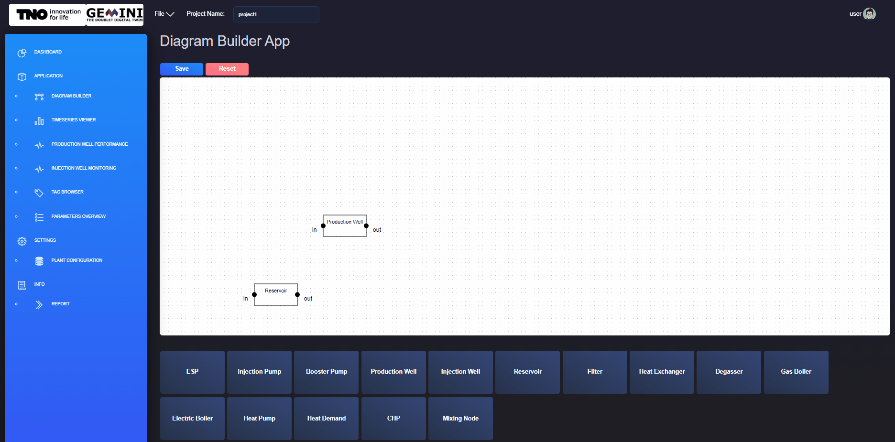
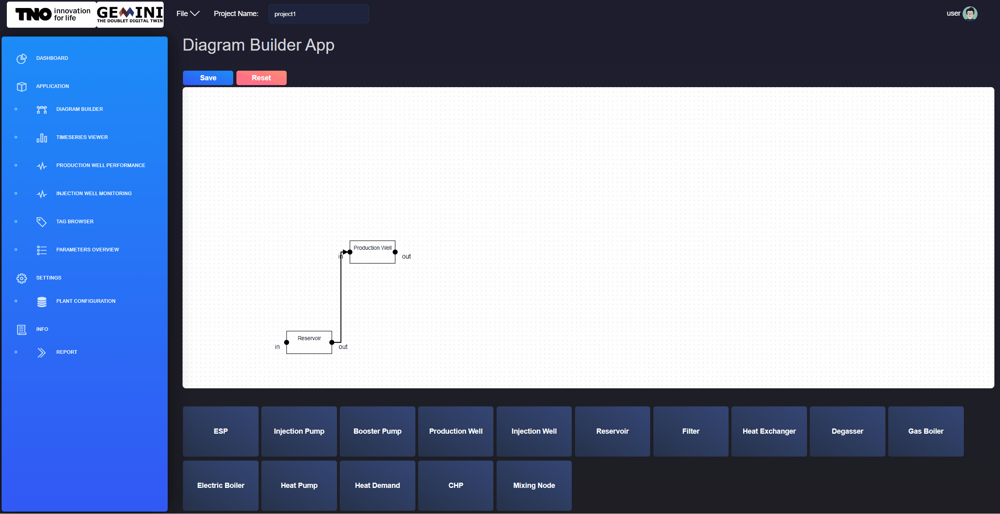

.. _system-setup:

Set-up
==============================================

This page serves as a guide on how to set up your first project, and include step-by-step instructions on how to create a representation of your physical system in the diagram builder, set asset parameters, and link to the corresponding tags in the plant database.

The first step to set-up your project is to create a new project. In the chapter :ref:`Projects <projects>`, instructions for creating a new project are given. If you do not have a project yet, you may go back to this chapter and follow the instructions.

Creating a plant in the diagram builder
--------------------------------------
--------------------------------------------
--------------------------------------
As soon as you have create your project, you can start setting it up. The first thing would be to model the plant geometry.

.. _new-component:

    Diagram builder application. Adding new component.

The diagram builder application allows you to model your plant. For a new project, you will see an empty canvas in the diagram builder application. You now need to add the components comprising your plant. You can do that by clicking on the component you need from the list of components in the bottom of your screen. The list is illustrated in figure :numref:`new-component`.

.. _add-move-component:

.. figure:: images/diagram_builder_add_move_component.gif
    :width: 100%
    :align: center

    Diagram builder application. Moving component on canvas.

As soon as you click on a component, it will appear on the top left of the canvas. As it is illustrated with figure :ref:`add-move-component`, you need to drag and drop each component to the location of your preference.

.. _connect-components:

    Diagram builder application. Creating a connection between two components.

You then need to connect your components to introduce relations between them and create a linear process for your plant. The connection can be created by clicking and dragging from one asset connection point to another. You can see an example in figure :numref:`connect-components`.

Adding asset parameters
--------------------------------------
--------------------------------------------
Now you should have a diagram of your plant. The next step is to add the required parameters to the components. This is possible via the diagram builder application.

.. _edit-component-parameters:

    Diagram builder application. Edit components parameters.

What you need to do is right click on one component and go through the parameters of the component. In :numref:`edit-component-parameters`, an example of a production well is given. In the example the soil temperature, productivity index and friction correlation are modified. Make sure to press the SAVE button to keep your changes. The SAVE button updates the json files in the project folder. Repeat this process for all of the components in your plant model.

For the production well and injection well, the trajectory is required.

Linking tags to plant assets
--------------------------------------

Viewing plant configuration and parameters
--------------------------------------
--------------------------------------
--------------------------------------------

Uploading and viewing documents
--------------------------------------
--------------------------------------------
