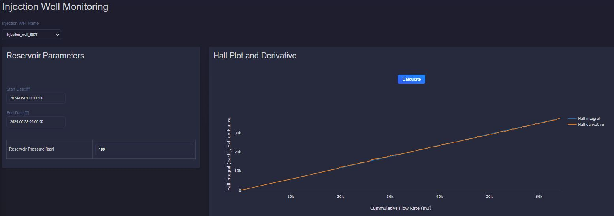

Injectivity Application
===========================

Description
---------------------------
This application provides the following features as the monitoring tools for injection in geothermal reservoir.

Injectivity Index
---------------------------
The injectivity index (II) is a measure of the capacity of a reservoir to accept fluids and reads:

.. math::

    II = \frac{Q}{\Delta P}

where:

- \Q\  is the injection rate
- \ \Delta P\  is the pressure difference (injection pressure - reservoir pressure)

Injectivity index can be plotted for specefic duration and a selected well via Tag Browser in the main menu:

.. image:: images/application_injectivity_index.JPG
    :width: 100%

Hall plot and its Derivative
----------------------------
The Hall integral equation is used in well testing to analyze injectivity. It integrates the pressure difference between injection and reservoir over time and being plotted versus cumulative flow rate. 

The Hall integral (HI) is given by:

.. math::

    HI = \int_{0}^{t} (\Delta P) dt

where:

- \ \Delta P\  is the pressure difference (injection pressure - reservoir pressure)
- \ t  is the time

The derivative of a Hall plot (D_Hall) can be calculated numerically by :

.. math::

    D_{Hall} = \frac{d \int_{0}^{t} (\Delta P) dt}{d \ln (Q)}

where:

- \ \Delta P\  is the pressure difference (injection pressure - reservoir pressure)
- \ t  is the time
- \ Q  is the flow rate

This tool allows to select a specific time duration and reservoir pressure as the inputs for the Hall plot for a selected well.

* The two curves of Hall and its derivative trace the same path when neither plugging or improvement occurs! 